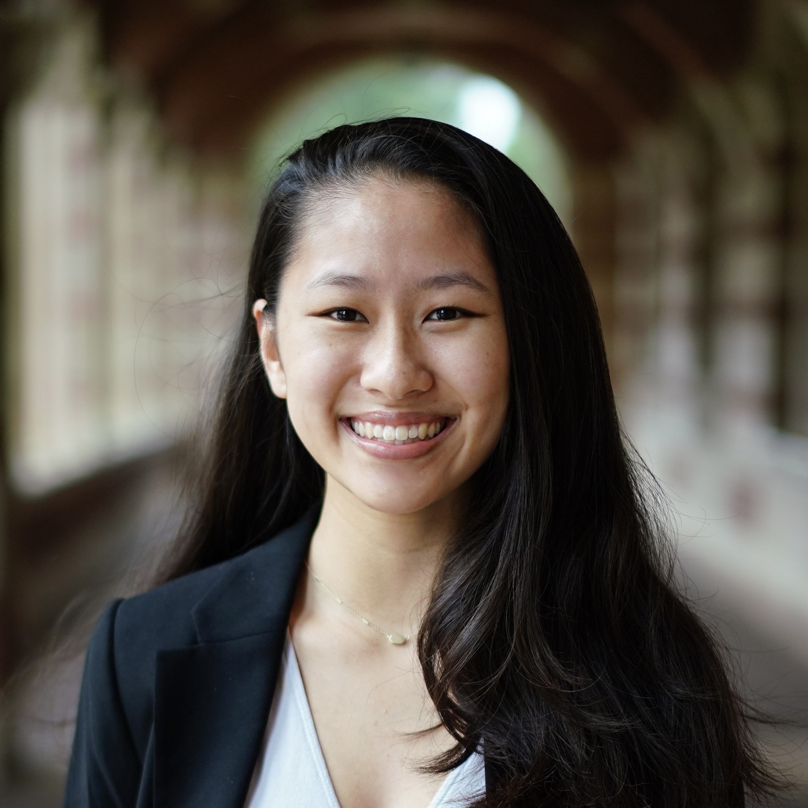

### Cassie Chou

<a href="https://linkedin.com/in/cassiecchou" class="profile-link">LinkedIn</a>

<a href="https://github.com/cassiecchou" class="profile-link">GitHub</a>

## About Me

I am a master's student at the Johns Hopkins Bloomberg School of Public Health studying biostatistics. My research interests lie in causal inference and machine learning with applications in environmental health, climate science, health disparities, and political and social determinants of health.

I am fortunate to be currently advised by Dr. Benjamin Huynh and Dr. Scott Zeger at Johns Hopkins, and previously advised by Dr. Noah Zaitlen and Jamie Matthews at UCLA.

If you'd like to reach out, my email is cchou24 {at} jh {dot} edu.

 

### Education {#education}

*Johns Hopkins Bloomberg School of Public Health* | Baltimore, MD  
ScM in Biostatistics | August 2024 - May 2026

*The University of California, Los Angeles (UCLA)* | Los Angeles, CA  
B.S. in Computational and Systems Biology, Minor in Statistics and Data Science | September 2020 - June 2024

